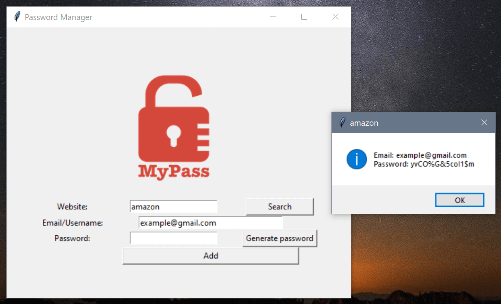

# Password Manager

A Tkinter GUI password manager desktop application. 



## How to play

First clone the repository and install all the required modules. Then run the following command:

```
python main.py
```

Fill all the fields before adding the password. The data will be stored in data.json file.

You can search for a specific password by enter the site name (try "amazon").

## Show your support

Give a ⭐️ if you like this project!

## License

[MIT](LICENSE)